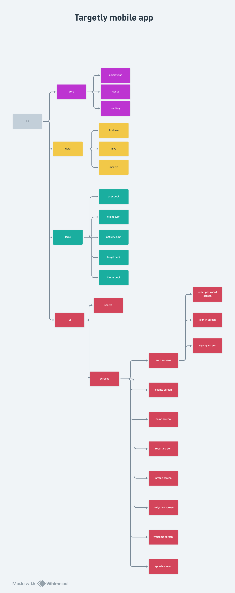

# Targetly
A Flutter-based sales tracking and commission management app built with Flutter.

## Project Structure

## Tech Stack
- Flutter & Dart
- BLoC / Cubit (State Management)
- Hive (Local Storage)
- Firebase Auth
- Easy Localization (Arabic & English)

## Features

### Authentication
- Email & password sign in / sign up
- Password reset via email
- Multi-user data isolation per Firebase UID

### Target Management
- Set monthly sales target with date range
- Track achieved vs remaining amount
- Animated progress bar
- Commission percentage calculation
- Reset target period

### Client Management
- Add / edit / delete clients
- Client details (name, phone, ID, fees)
- Subscription status tracking
- Client comments system (add / edit / delete)
- Search by name, phone, or ID
- Filter (all / subscribed / unsubscribed)
- Direct call from app

### Reports
- Custom date range reports
- Sales summary (clients, remaining, sales, commission)
- Target progress indicator
- Sales line chart over time
- View clients in selected period

### Home Screen
- Animated header with username & job title
- Target card with live progress
- Commission & clients stat cards
- Today's summary
- Recent activity feed

### Profile & Settings
- Edit username and job title
- View account email
- Dark mode toggle
- Language switch (Arabic / English)
- Clear all data
- Reset target period
- App version info

### UI & UX
- Full dark mode support
- Arabic & English localization
- Staggered animations on home screen
- Animated splash screen with logo
- Smooth dialog animations
- Responsive design
